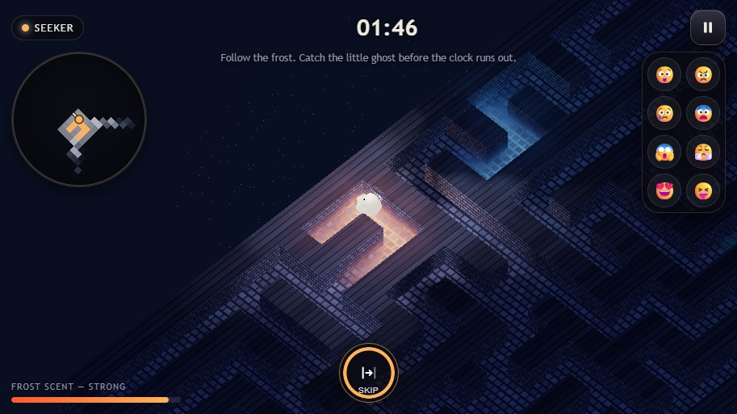
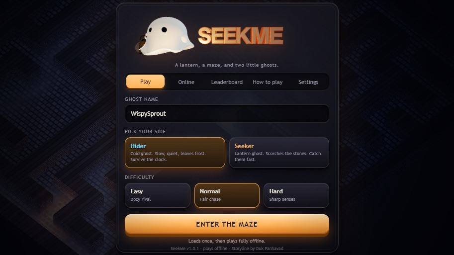
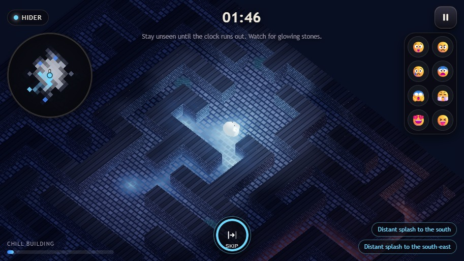
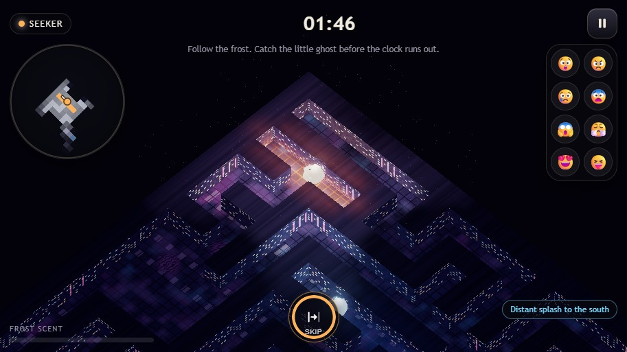
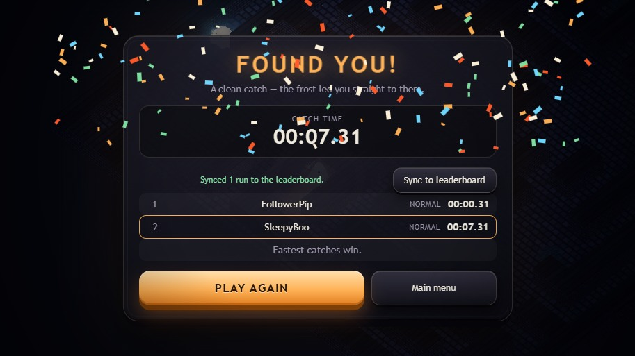
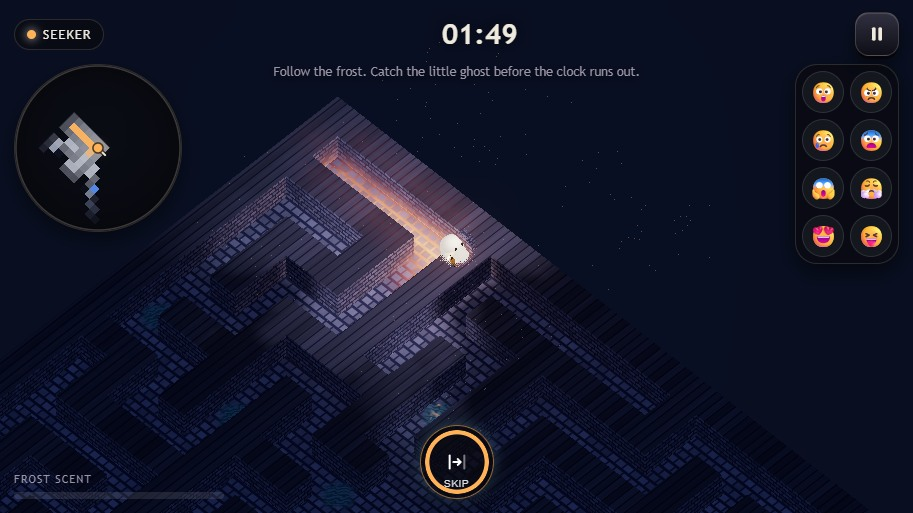
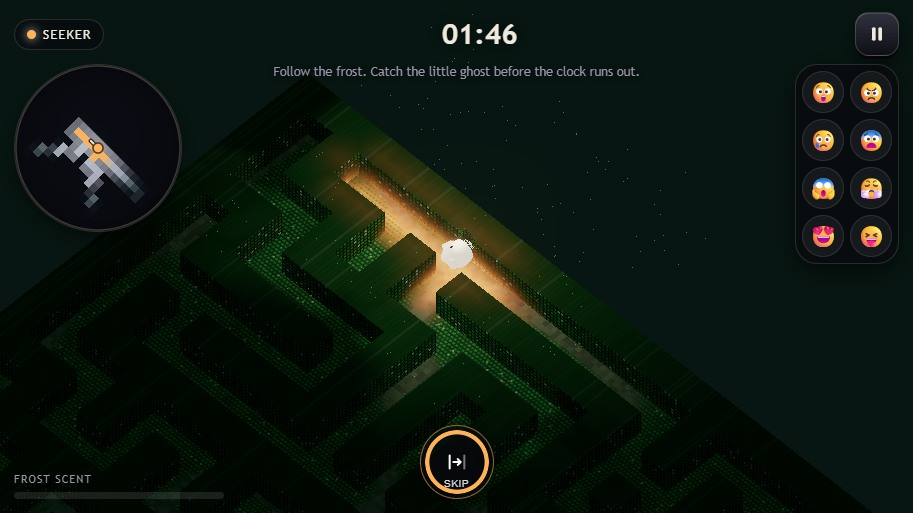

# SeekMe 👻



> *The seeker's lantern scorches the cobbles red; the hider's frost still glows blue two corridors
> away. Follow it before it fades.*

A semi-3D hide & seek game built with [three.js](https://threejs.org/). Two little sheet ghosts
chase each other through a dark cobblestone maze: a **warm seeker** with a lantern that scorches the
stones, and a **cold hider** whose frost creeps across them. Everything the two ghosts do leaves a
mark, and reading those marks *is* the game.

**Storyline by Duk Panhavad.**

The whole game is downloaded once and then **runs entirely in the browser, offline**. Scores are kept
on the device and pushed to the server leaderboard whenever a connection is available — retry as many
times as you like, nothing is ever lost or double-counted.

---

## Screenshots

| | |
|---|---|
| <br>**The menu is part of the game.** A full AI-vs-AI demo match plays out behind it, and the title is a real 3D object lit by a flickering lantern. | <br>**Playing the hider.** Your own frost is the thing that gives you away — and a splash alert names the direction a ghost just crossed water. |
| <br>**Three dressings, one game.** Themes repaint the sky, the ground and the walls, but never touch the layout, the trails or the ponds. | <br>**Win big.** Take the round and your ghost dances under a shower of sparks while the run is queued for the leaderboard. |

---

## The game

| | Hider (cold) | Seeker (warm) |
|---|---|---|
| Look | pale ghost with a small cyan wisp | pale ghost with an amber lantern |
| Speed | slower, quieter | faster |
| Trail | **blue frost** that deepens the longer it stands still | **red-hot scorch** on stones *and* walls |
| Wins by | surviving the full clock | catching the hider as fast as possible |

* **Trails fade.** A scorch mark cools in ~16 s, frost in ~26 s. If you can see a mark it means
  someone was here *recently*, and its brightness tells you whether they sprinted past or loitered.
* **Walls remember too.** The seeker's lantern heat glows in the mortar of nearby walls, so you can
  spot a corridor they swept without seeing the floor.
* **Melt ponds.** Stand still too long as the hider and the frost melts into a **permanent** puddle.
* **Wall skip.** Once charged, `Space` (or the dial in the corner) lets your ghost slip through a
  single wall — a get-out-of-jail card for the hider and a shortcut for the seeker. It is a *long*
  charge: ~22 s of walking, and only ~60 % of that rate while you stand still. Keep moving and the
  recharge speeds up the longer your walk lasts, capped at 1.8× so it can never be spammed
  (≈12 s at a flat-out run). Using it resets the walking streak, and a skip is refused when the far
  side of the wall is solid rock.
* **Splash!** Any ghost crossing a pond (natural or melted) makes a positional sound both players
  hear. The HUD names the direction; the world shows a ripple ping through the walls.
* **Fog of war.** You only see what your own light reaches, with real shadow-casting around corners.
  Places you have already been stay dimly remembered.
* **Minimap.** The dial in the top-left corner only draws ground you have already been through *and*
  that something still lights: your own glow right now, or a heat/frost trail that has not faded yet.
  As a trail cools it dims out of the dial, so the map forgets a corridor at exactly the moment the
  stones do. It is turned to match the camera, so up on the dial is up on screen, and remembered
  ground wears the current theme's tint.
* **Countdown.** The seeker is frozen for three seconds while the hider slips away.
* **Round length** is 2 minutes.
* **Every round is a new maze.** The size, the loops, the plazas and the ponds are all rolled fresh
  from the round's seed.
* **Win big.** Take the round and your ghost throws a little victory dance under a shower of sparks
  and confetti.

### Play with a friend

Open the **Online** tab, pick the side you want, and hit **Create game code**. Share the four-letter
code; your friend types it in and you both drop into the same maze — same layout, same ponds, same
clock. There is no account, no lobby list and no matchmaking: the code *is* the room.

The wire format is deliberately tiny. Each client owns its own ghost and publishes a ~40-byte
transform packet 15 times a second; everything else (the maze, the trails, the fog of war, the
lighting) is derived locally from the shared seed. Only genuine one-off events — a splash, a new melt
pond, a wall skip, a catch, the final whistle — are relayed, and each is owned by exactly one side so
the two clients can never double-count them. If your friend disconnects, the round is awarded to you.

### Controls

| Action | Input |
|---|---|
| Move | `W` `A` `S` `D` / arrow keys, or drag anywhere on touch |
| Wall skip | `Space` / `F`, or the charge dial in the bottom-right |
| Emotes | `1` – `8`, or the emote pad in the top-right |
| Pause | `Esc` or the **Menu** button |
| Mute | `M` |

### Brightness

Phone screens lose detail in near-black scenes, so the maze ships a little brighter and carries a
**Brightness** slider — in the **Settings** tab on the menu, and inside the pause dialog for mid-round
tweaks. It scales the renderer exposure between 80% and 135%, a clamp wide enough to suit a sunny bus
ride or a dark room but narrow enough that the night never washes out. The choice is stored per device
in `localStorage` and re-applied (and re-clamped) on load.

### Themes

The **Settings** tab also holds a **maze theme** picker. A theme is pure dressing — sky colour, fill
light, bloom, drifting motes and the two shader chunks that paint ground and walls — so it can never
change how a round plays: the layout, the trails and the ponds are identical in all three.

| Old temple | Garden park | Neon city |
|---|---|---|
|  |  |  |
| The original haunt: lantern-lit cobbles, brick alleys, moonlit blue night | Clipped hedge walls, a lawn with a gravel path and flower beds, fireflies | Tokyo after midnight: wet asphalt, lit windows flickering in the facades, neon signs |

Themes live in [`src/render/themes.ts`](src/render/themes.ts); each one supplies a `themeFloor` and a
`themeWall` GLSL function, and the picker builds itself from that table, so adding a fourth theme is a
single object. The pick is stored per device in `localStorage` and the menu's demo match restarts on a
change so you can see it straight away.

---

## Run it

### Docker Compose (recommended)

```bash
docker compose up --build -d
# open http://localhost:8080
```

* Leaderboard data is stored in the named volume `seekme-data` (`/data/scores.json` in the container).
* Change the published port with `SEEKME_PORT=9000 docker compose up -d`.
* The container has a health check on `/api/health`.

### Local development

```bash
npm install
npm run dev      # Vite dev server on http://localhost:5173 (proxies /api to :8080)
npm run serve    # the API/static server on http://localhost:8080
```

### Local production build

```bash
npm run build    # type-check + bundle into dist/
npm run serve    # serve dist/ and the leaderboard API on :8080
```

Environment variables for the server: `PORT`, `HOST`, `PUBLIC_DIR`, `DATA_DIR`.

---

## Offline & syncing

1. The first load installs a service worker that precaches the whole build (`sw.js` is generated at
   build time with the exact asset list). After that the game boots with no network at all.
2. Finished rounds are written to `localStorage` immediately and queued for upload.
3. The queue is flushed when you finish a round, when the browser fires `online`, every 30 s while
   anything is pending, and whenever you press **Sync**.
4. Every submission carries a stable UUID, and the server treats a re-sent id as already accepted —
   so retrying forever is safe and can never duplicate a score.
5. While offline the leaderboard shows the last copy this device downloaded, clearly marked as such.

Leaderboards keep one personal best per device: **seekers** rank by fastest catch (wins only),
**hiders** by longest survival.

---

## API

| Method | Path | Notes |
|---|---|---|
| `GET` | `/api/health` | liveness, stored score count, open rooms |
| `GET` | `/api/leaderboard?role=seeker\|hider&limit=25` | ranked rows |
| `POST` | `/api/scores` | `{ "scores": [ … ] }`, idempotent by `id`, max 200 per call |
| `WS` | `/ws` | private match relay (create / join / state / event) |

Submitted fields are validated and clamped server-side (name length, role, difficulty, time range),
and names are stripped of control characters. The WebSocket endpoint is a hand-written RFC 6455
implementation — no dependencies — and the relay never trusts clients with anything but their own
ghost.

---

## How it is built

```
src/
  core/        maze generation, flow-field pathfinding, shadowcast visibility, the trail field
  game/        config/tuning, entities + collision, rival AI, round rules, input
  render/      stage & bloom, maze themes + floor/wall shaders, the ghost rig, 3D title, splash effects
  audio/       every sound synthesised at runtime with Web Audio (no audio files)
  net/         leaderboard client + offline queue, online match session
  ui/          menus, HUD, minimap dial, leaderboard rendering, confetti
server/
  server.mjs   dependency-free static host + leaderboard API
  ws.mjs       hand-rolled WebSocket (RFC 6455) server
  rooms.mjs    join-code rooms and the match relay
docs/          the screenshots used in this README
```

Some implementation notes:

* **The trail field** is a grid of `heat`, `cold`, `pond` and `visibility` values packed into an RGBA
  `DataTexture`. The floor and wall shaders sample it, so thousands of glowing marks cost one texture
  fetch instead of thousands of objects. Walls sample the corridor tile their face looks into, which
  is what makes them glow where the lantern passed.
* **Visibility** uses recursive shadowcasting on the grid, so corners genuinely hide you.
* **The rival AI plays by the same rules as you:** it only sees what it has line of sight to, follows
  frost it can actually see, investigates splashes it is close enough to hear, and sweeps the alleys
  it has not checked recently. Difficulty changes its senses, not its rulebook.
* **The menu is part of the game.** Behind it a full AI-vs-AI demo match plays out in the same maze,
  and the title is a genuinely 3D object — extruded, bevelled letters lit by a flickering lantern
  with the game's own ghost model standing beside them, rendered in its own canvas and tilting with
  the pointer.
* **Walls between the camera and your ghost** dissolve with an ordered dither instead of going
  transparent, which keeps depth sorting simple.
* **Everything is procedural.** No textures, models, fonts or audio files are downloaded: the
  cobblestones, hedges, neon facades, ghosts, splashes and every sound are generated in code.

### Debug harness

Open with `?debug=1` to expose `window.__seekme` (`start(role)`, `tick(dt, steps)`, `hold(x, y)`,
`skip()`, `state()`), which steps the simulation deterministically — handy for automated testing.

---

## License

Built as a demo project; all art, geometry and audio are generated procedurally in code.
